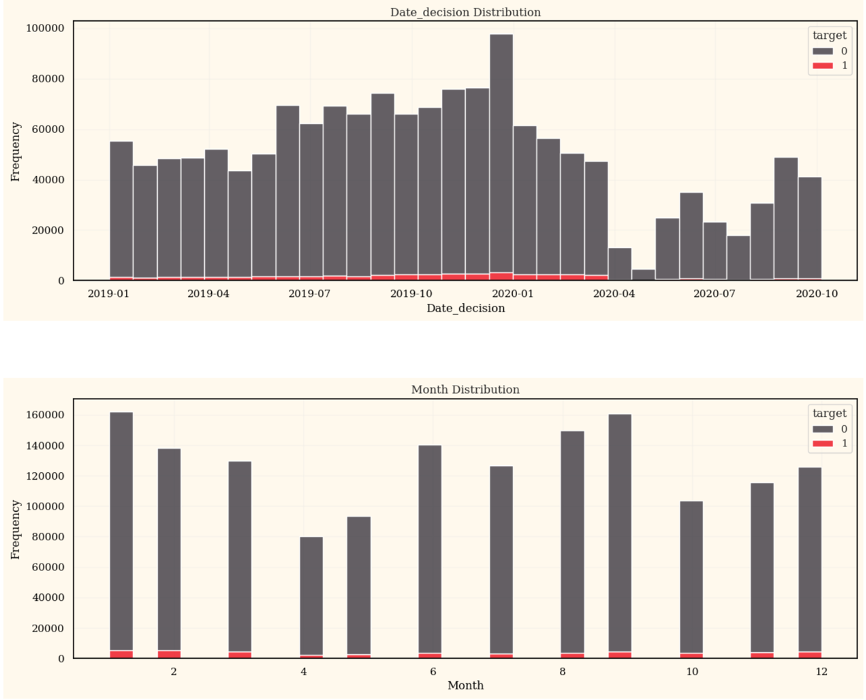
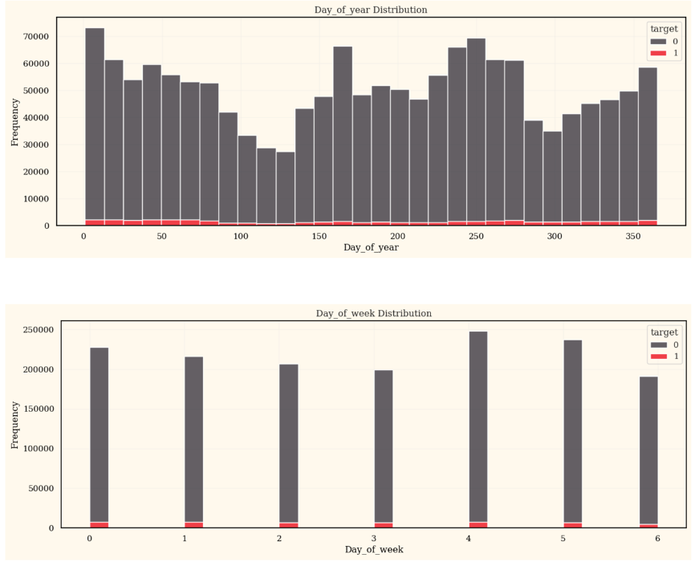
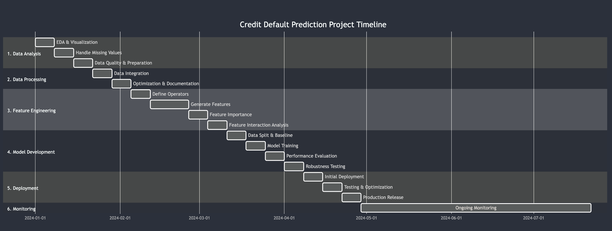

# Final Project Proposal

**Group members**[Group3]: Yang Lan, Zixuan Tao, Yanan Lu, Wielen Ding, Jiarong Zhang

## Research Background

There are many people in the real world struggle to get loans due to insufficient or non-existent credit histories. And, unfortunately, this population is often taken advantage of by untrustworthy lenders.

Home Credit strives to broaden financial inclusion for the unbanked population by providing a positive and safe borrowing experience. In order to make sure this underserved population has a positive loan experience, Home Credit makes use of a variety of alternative data to predict their clients' repayment abilities and make precise decisions on the amount of money to lend.

Credit decisioning is a cornerstone of the modern financial ecosystem. It involves evaluating the creditworthiness of individuals or organizations to determine their eligibility for loans or credit facilities. This process is critical for financial institutions, as it ensures that resources are allocated to borrowers who are most likely to repay their obligations while minimizing the risk of default.

In today's world, the ability to make accurate credit decisions has become more challenging yet essential due to the increasing complexity of financial markets and the diversity of potential borrowers. Traditional credit scoring methods, such as relying solely on credit history, often fail to capture the nuances of a borrower's financial behavior, especially for individuals with limited credit history. This gap highlights the importance of developing advanced, data-driven methodologies to improve credit decisioning processes.

The Home Credit problem on Kaggle exemplifies this challenge. It provides a real-world dataset from the financial services industry, where participants are tasked with predicting the repayment ability of a borrower. The dataset includes a rich mix of demographic, financial, and behavioral information about borrowers, making it an excellent opportunity to explore and address the complexities of credit decisioning.

The importance of solving such problems extends beyond financial institutions. Improved credit decisioning can lead to more equitable access to financial services, foster economic growth, and reduce systemic risks in financial systems. By leveraging data science techniques, such as machine learning and feature engineering, we aim at creating models that are not only more accurate but also fairer and more inclusive, ensuring that credit reaches those who need it most without undue bias.

## Data Description

The dataset is provided by Home Credit and contains real-world customer and loan data from its operations. The dataset includes 138 CSV files & Parquet files, each serving specific tasks and analyses.

**Number of .csv files in:   ./csv_files/train:** **32**

**Number of .csv files in: ./parquet_files/train:** **32**

**Number of .csv files in:   ./csv_files/test:** **36**

**Number of .csv files in: ./parquet_files/test:** **36**

**Total Size**: Compressed: Approximately **26.77GB**.

External data sources are provided by several credit bureau providers. Each group of tables can comprise one or more individual tables. If a group contains more than one table, they are divided based on WEEK_NUM. This division was implemented to restrict the maximum size of the tables.

#### Data Structure

- **Internel Files**:
  - **Depth 0**: 
    - train_static_0_0.csv 
    - train_static_0_1.csv

  - **Depth 1**: 
    - train_applprev_1_0.csv
    - train_applprev_1_1.csv
    - train_other_1.csv
    - train_deposit_1.csv
    - train_person_1.csv
    - train_debitcard_1.csv

  - **Depth 2**: 
    - train_applprev_2.csv
    - train_person_2.csv

- **Externel Files**:
  - **Depth 0**: 
    - train_static_cb_0.csv 

  - **Depth 1**: 
    - train_tax_registry_a_1.csv
    - train_tax_registry_b_1.csv
    - train_tax_registry_c_1.csv
    - train_credit_bureau_a_1_0.csv
    - ……
    - train_credit_bureau_a_1_3.csv
    - train_credit_bureau_b_1.csv

  - **Depth 2**: 
    - train_credit_bureau_a_2_0.csv
    - ……
    - train_credit_bureau_a_2_10.csv
    - train_credit_bureau_b_2.csv


The test dataset has the same naming convention as the train dataset above.

**The meaning of Depth values:** 

- depth=0. These are static features directly tied to a  specific case_id. Columns in it are attributes that are aggregated on case_id level.  Example can be age of client or gender, 1 record per 1 case id.
  
- depth=1. In these files, each case_id has an associated historical record, indexed by num_group1. those are attributes where we have several records per client/application. Example can be previous applications or loans in credit bureau register, each client can have from 0 to n records. Therefore, for one case_id there might be several records, and to index them we use num_group1
  
- depth=2. In these files, each case_id has an associated historical record, indexed  by both num_group1 and num_group2. For some attributes with depth=1 we have more detailed information, for example for previous applications we  have data about instalments like date of payments or days past due of each payments. It means for each previous application, you can have 0…n  records about instalments/payments. And as an index is used num_group2.

To sum up, 1 client can have several previous applications, and each of those previous applications can have several records about instalments, payments, days past due, etc. 

**Feature Groups**: 

- Various predictors were transformed, therefore we have the ollowing notation for similar groups of transformations:
  - P - Transform DPD (Days past due) (A negative value indicates the number of days before the due date.)
  - M - Masking categories
  - A - Transform amount
  - D - Transform date
  - T - Unspecified Transform
  - L - Unspecified Transform

- **Special columns**: train_base contains case_id，date_decision，MONTH，WEEK_NUM，target.
  - case_id - This is the unique identifier for each credit case.  You'll need this ID to join relevant tables to the base table.
  - date_decision - This refers to the date when the company makes a decision regarding the approval of the loan.
  - WEEK_NUM - This is the week number used for aggregation. In the test sample, WEEK_NUM continues sequentially from the last training value of WEEK_NUM.
  - MONTH - This column represents the month and is intended for aggregation purposes.
  - target - This is the target value, determined after a certain period based on whether or not the client defaulted on the specific      credit case (loan).
  - num_group1 - This is an indexing column used for the historical records of case_id in both depth=1 and depth=2 tables.
  - num_group2 - This is the second indexing column for depth=2 tables' historical records of case_id. The order of num_group1 and num_group2 is important and will be clarified in feature definitions.


Example:

- pmts_dpd_1073P: Days past due of the payment for the active contract (num_group1 - **existing contract**, num_group2 - payment); 

- pmts_dpd_303P: Days past due of the payment for terminated contract according to credit bureau (num_group1 - **terminated contract**, num_group2 - payment). 

 #### Data Statistics

There are 465 features and 436 respective descriptions in feature_definitions.csv. There are no missing descriptions so it means some feature might have same descriptions (for example description Number of tax deductions for features: pmtcount_4527229L, pmtcount_4955617L, pmtcount_693L). static_0_2, credit_bureau_a_1_4, credit_bureau_a_2_11, applprev_1_2 are missing in the train folder.

```
The total of case_id is 1526659 with no dups. 
----------Train data----------
[INFO] Actual date range:  644 day(s). 
[INFO] Total unique dates: 644 day(s).
 
[INFO] Min date: 2019-01-01 
[INFO] Max date: 2020-10-05
 
----------Test data----------
 
[INFO] Actual date range:  2 day(s). 
[INFO] Total unique dates: 2 day(s).
 
[INFO] Min date: 2020-10-06 
[INFO] Max date: 2020-10-07
```





**Notes:**

- The dataset is extremely imbalanced, which is expectable for such domain.
- It seems covid-19 impacted the number of observations greatly.
- Interesting fact, the bank makes decision even on the weekends.     Clearly, this process is automated and runs on a predefined schedule.
- The dataset has a large number of null values.
- there are duplicate columns for active and closed contracts, e.g.     

| annualeffectiverate_199L | Interest rate  of the closed contracts.  |
| ------------------------ | ---------------------------------------- |
| annualeffectiverate_63L  | Interest rate  for the active contracts. |

so we have to merge each pair into one to build aggregations based on all contracts, retaining active and closed contract aggregations as well.

- There’re same data from different source like birth date, mployment length, taxes, and other columns that were present in the     dataset more than once. 

## Task Breakdown

The end goal of our project is to develop an algorithm capable of predicting potential clients' default risks (Y/N) using historical data, which can assist the company in managing credit risk effectively. Additionally, we want to attach great significance on the stability of prediction by incorporating stability directly into training model / loss function (not on the level of feature preparation or feature selection).

#### **1. Conduct Extensive Data Analysis**

**Timeline**: 3 weeks
 **Goal**: Gain a thorough understanding of the dataset, identify missing data, detect anomalies, and prepare a clean dataset for downstream processes.
 **Sub-tasks**:

- Week 1:
  - Perform exploratory data analysis (EDA) to understand data distribution.
  - Visualize patterns and relationships between key variables (e.g., correlation analysis).
- Week 2:
  - Identify and handle missing values.
  - Perform outlier detection and removal.
- Week 3:
  - Conduct data quality checks to ensure data consistency.
  - Prepare a clean dataset for integration with other sources.

------

#### **2. Handle Large Files and Optimize Data Processing**

**Timeline**: 2 weeks
 **Goal**: Efficiently process and integrate large datasets using optimized tools and frameworks (e.g., Polars).
 **Sub-tasks**:

- Week 1:
  - Merge datasets (e.g., transaction history, customer profiles) using Polars for high performance.
  - Conduct schema validation to ensure compatibility.
- Week 2:
  - Optimize file handling for scalability (e.g., chunk processing).
  - Document data integration pipelines for reproducibility.

------

#### **3. Feature Engineering**

**Timeline**: 5 weeks
 **Goal**: Generate meaningful features that capture clients' default behaviors and select the most predictive features for the model.
 **Sub-tasks**:

- Week 1:
  - Define key operators for feature generation (e.g., rolling averages, ratios, trend indicators).
  - Create a roadmap for batch-wise feature generation.
- Week 2-3:
  - Generate derived features based on historical data using operators.
  - Perform domain-specific feature engineering (e.g., credit score buckets, payment delays).
- Week 4:
  - Evaluate feature importance using a benchmark model (e.g., LightGBM).
  - Select top features contributing to predictive power.
- Week 5:
  - Conduct feature interaction analysis.
  - Ensure selected features are interpretable and relevant.

------

#### **4. Train and Evaluate Machine Learning Models**

**Timeline**: 4 weeks
 **Goal**: Train a robust ML model for default prediction and validate its performance on a holdout dataset.
 **Sub-tasks**:

- Week 1:
  - Split data into training, validation, and test sets.
  - Define baseline models (e.g., logistic regression, random forest).
- Week 2:
  - Train models using selected features.
  - Tune hyperparameters using cross-validation.
- Week 3:
  - Evaluate model performance (e.g., precision, recall, AUC, stability).
  - Compare results against baseline metrics.
- Week 4:
  - Ensure robustness by testing models on out-of-time datasets.
  - Document the final model pipeline.

------

#### **5. Deployment in Production Environment**

**Timeline**: 3 weeks
 **Goal**: Integrate the trained model into the company’s systems to predict default risks in real-time.
 **Sub-tasks**:

- Week 1:
  - Collaborate with the engineering team to deploy the model.
  - Set up a monitoring system to track model predictions and feedback.
- Week 2:
  - Test the model in a staging environment to ensure seamless operation.
  - Address scalability and latency issues.
- Week 3:
  - Go live with the model in production.
  - Begin collecting data for continuous improvement.

------

#### **6. Post-Deployment Monitoring and Continuous Improvement**

**Timeline**: Ongoing
 **Goal**: Ensure the deployed model performs well over time and adapts to changes in client behaviors.
 **Sub-tasks**:

- Regularly monitor model performance using live data.
- Retrain the model periodically with updated datasets.
- Incorporate new features as needed based on evolving business requirements.

